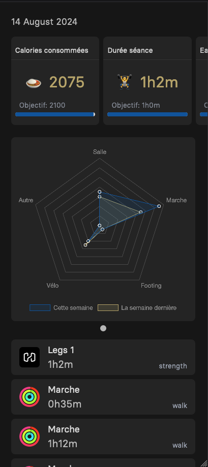

# Zelvy

# What it is

Discord bot created in order to keep me accountable for my daily fitness related tasks. \
Each day the bot checks if each goals has been completed. These goals are:

- `Xh` gym session
- `Xh` of cardio (can be soft, like walking)
- Less than  `Xkcal` consumed
- More than `Xkcal` burned
- More than `XL` of water drank

If one of these goals is not met, the bot will mentionned the pre-determined winner and I will owe this person 5€.\
Each value is a variable and therefore can be changed at any time (depending on my objectives).

# Technical details

It's a monorepo with a single go module
This project is composed of four parts each containing a `README.md` file with more information:

- 🤖 [Bot](https://github.com/rangodisco/zelvy/tree/main/bot) written in Go with
  the [discordgo](https://github.com/bwmarrin/discordgo) library
- 🖥 [Server](https://github.com/rangodisco/zelvy/tree/main/server) written in Go
  with [Protobuf](https://protobuf.dev/), [gRPC](https://grpc.io/), [Gorm](https://github.com/go-gorm/gorm)
  and [PostgreSQL](https://www.postgresql.org/).

[//]: # (- 🌐 The server also includes a frontend written)

[//]: # (  with [Templ]&#40;https://github.com/a-h/templ&#41;, [htmx]&#40;https://github.com/bigskysoftware/htmx&#41;, [TailwindCSS]&#40;https://github.com/tailwindlabs/tailwindcss&#41;)

[//]: # (  and [DaisyUI]&#40;https://github.com/saadeghi/daisyui&#41;)
- 📱 [Companion app](https://github.com/rangodisco/zelvy-companion) Written in Kotlin

# Backstory

The name comes from the J1 League football team [Machida Zelvia](https://www.zelvia.co.jp/)'s mascot Zelvy.
